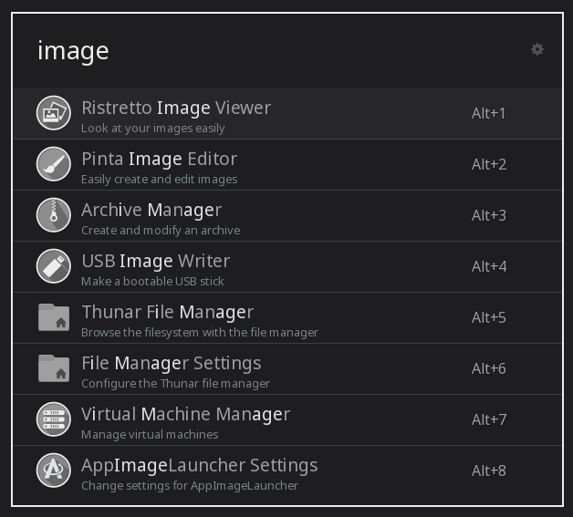

# Monochrome Theme for Ulauncher

A dark theme for ULauncher to fit [Monochrome theme for KDE](https://gitlab.com/pwyde/monochrome-kde).



## Installing

- Create a ULauncher themes folder if one doesn't already exist

```
mkdir ~/.config/ulauncher/user-themes
```

- Change directory to the themes folder

```
cd ~/.config/ulauncher/user-themes
```

- Clone this repository

```
git clone git@github.com:patryk-mol/ulauncher-monochrome-theme.git
```
